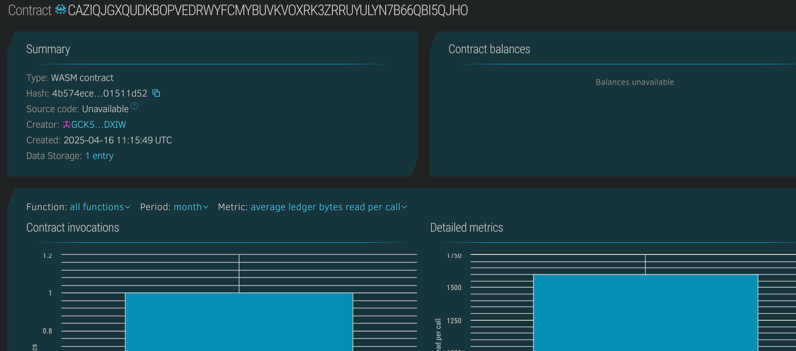

# KYC Verification dApp

## 🧠 Project Description
The KYC (Know Your Customer) Verification dApp is a decentralized identity management system that allows verified entities to submit and manage user KYC data on-chain. It helps reduce fraud and enables other dApps to query verified identity statuses securely on the Stellar blockchain.

## 🎯 Project Vision
To decentralize and streamline identity verification processes, empowering users with control over their personal data while enabling trusted KYC validation for dApps and services.

## 🔑 Key Features
- 🔐 KYC submission and verification
- ✅ Only approved verifiers can validate users
- 📁 View user KYC status (verified/unverified)
- 📚 On-chain record of verifications

## 🚀 Future Scope
- Role-based permissioning (verifiers, users)
- Encrypted off-chain storage of sensitive documents
- Integration with other dApps for KYC-as-a-service
- Verifier reputation system

## 📦 Tech Stack
- Soroban Smart Contracts (Rust)
- Stellar Blockchain
- Soroban CLI and SDK

## Contract Details
CAZIQJGXQUDKBOPVEDRWYFCMYBUVKVOXRK3ZRRUYULYN7B66QBI5QJHO
